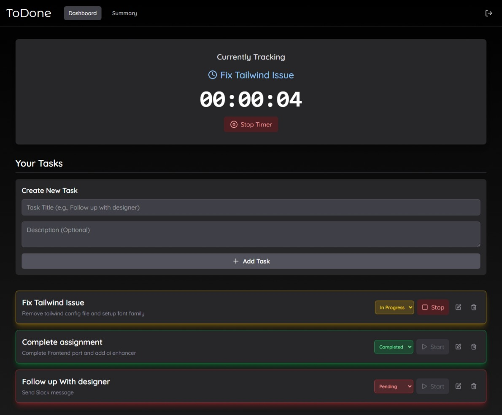
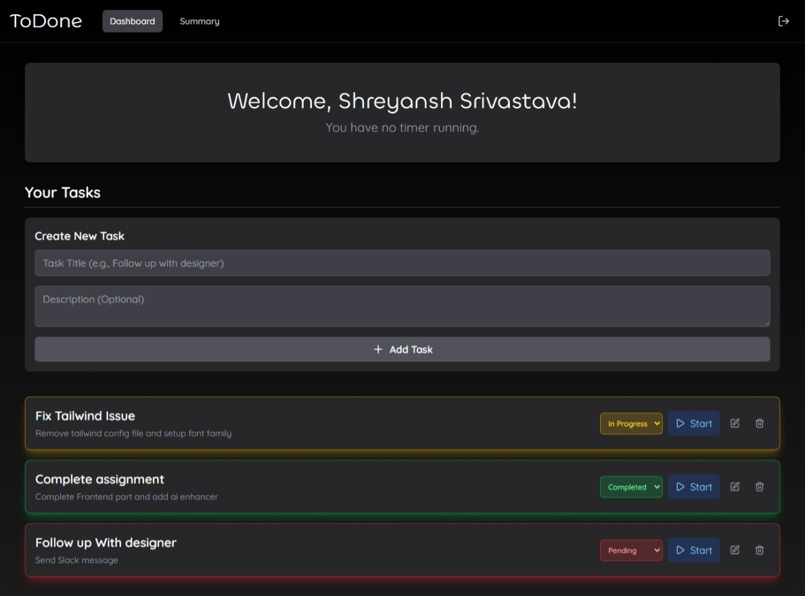
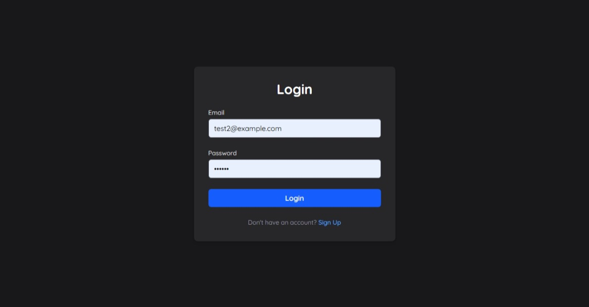
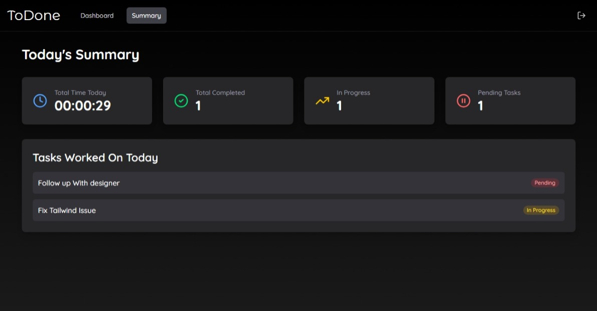

# ToDone - Task & Time Tracking App

> **IMPORTANT:** This application uses a cross-domain `httpOnly` cookie for authentication (frontend on Vercel, backend on Render).
>
> **You may need to explicitly "Allow third-party cookies" for this site in your browser settings for the login to work.**
>
> Many modern browsers (especially Chrome in Incognito) block this by default as a privacy setting.

## 🚀 Live Demo

* **Frontend (Vercel):** `https://to-done-six.vercel.app/`
* **Backend (Render):** `https://todone-4vjo.onrender.com/`

### Test Credentials

For a quick review, you can use these credentials:
* **Email:** `test2@example.com`
* **Password:** `123456`

## 📸 Screenshots







## ✨ Features

* **Secure Authentication:** Users can sign up, log in, and log out. All routes and API endpoints are protected.
* **Data Isolation:** Users can only see and manage their own tasks and time logs.
* **Full Task CRUD:** Create, Read, Update (title, description, status), and Delete tasks.
* **Real-Time Time Tracking:** Start and stop a timer for any task. The global timer is visible and persists across the app.
* **Productivity Summary:** A "Daily Summary" page that shows total time tracked, tasks worked on, and status counts for the current day.
* **Visual Status:** Tasks are color-coded with a "glow" effect (Red, Yellow, Green) to represent Pending, In Progress, and Completed statuses.

## 🛠️ Tech Stack

### Frontend (Client)
* **Framework:** React (Vite)
* **Routing:** React Router
* **State Management:** React Context API
* **Styling:** Tailwind CSS (v4)
* **API Client:** Axios (with environment-aware baseURL)

### Backend (Server)
* **Framework:** Node.js & Express
* **Database:** MongoDB (with Mongoose)
* **Authentication:** JWT (JSON Web Tokens)
* **Security:** bcryptjs (password hashing), CORS

## 🔧 Local Development Setup

You will need two terminals running concurrently to run the app locally.

### 1. Backend (Server)

1.  Navigate to the `server` directory:
    ```bash
    cd server
    ```
2.  Install all dependencies:
    ```bash
    npm install
    ```
3.  Create a `.env` file in the `/server` directory and add the following variables:
    ```env
    MONGO_URI=<YOUR_MONGODB_CONNECTION_STRING>
    JWT_SECRET=<YOUR_OWN_SECRET_KEY>
    PORT=5000
    ```
4.  Run the server in development mode:
    ```bash
    npm run dev
    ```
    The backend will be running at `http://localhost:5000`.

### 2. Frontend (Client)

1.  Open a **new terminal**.
2.  Navigate to the `client` directory:
    ```bash
    cd client
    ```
3.  Install all dependencies:
    ```bash
    npm install
    ```
4.  Run the client-side Vite server:
    ```bash
    npm run dev
    ```
    The app will be available at `http://localhost:5173`. The Vite proxy (`vite.config.js`) is configured to forward all `/api` requests to your backend at `http://localhost:5000`.